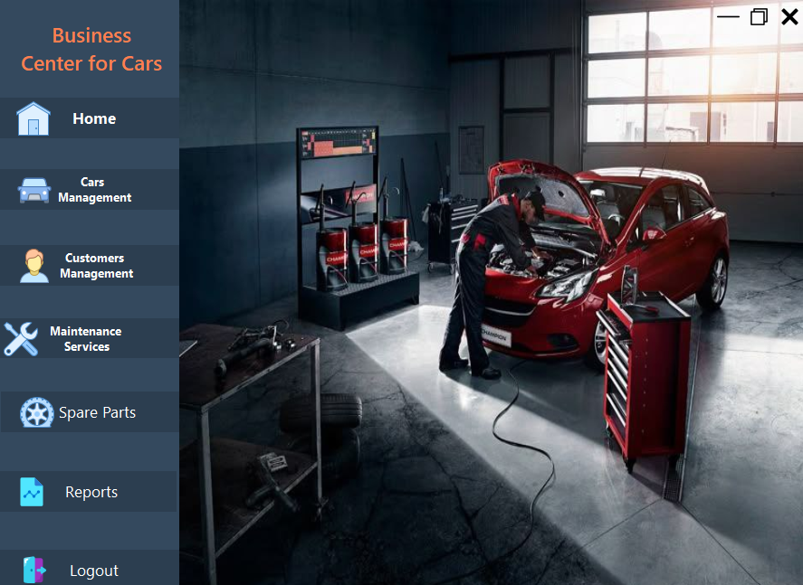
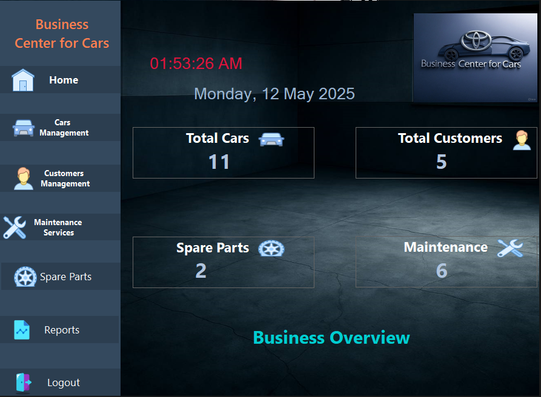
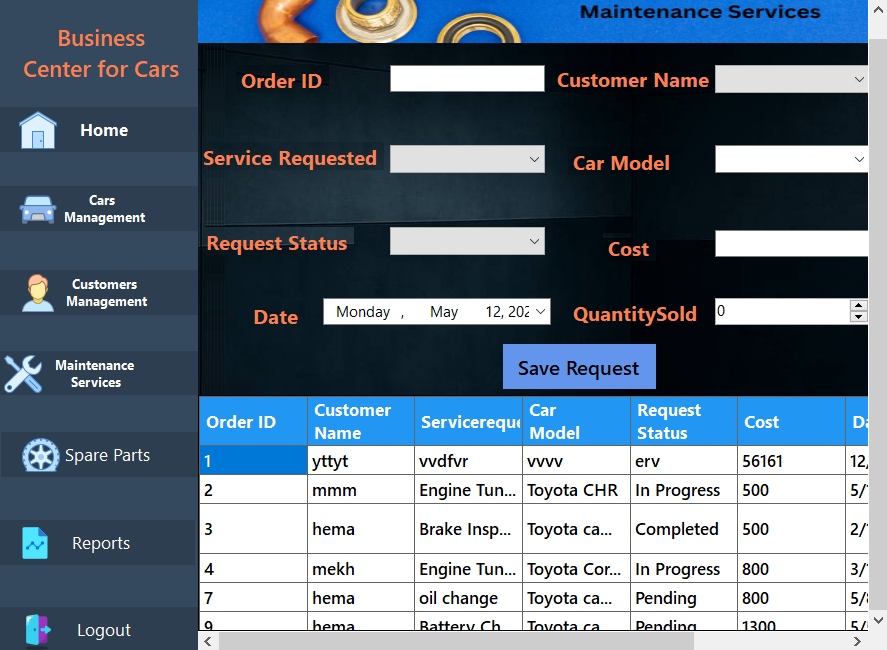
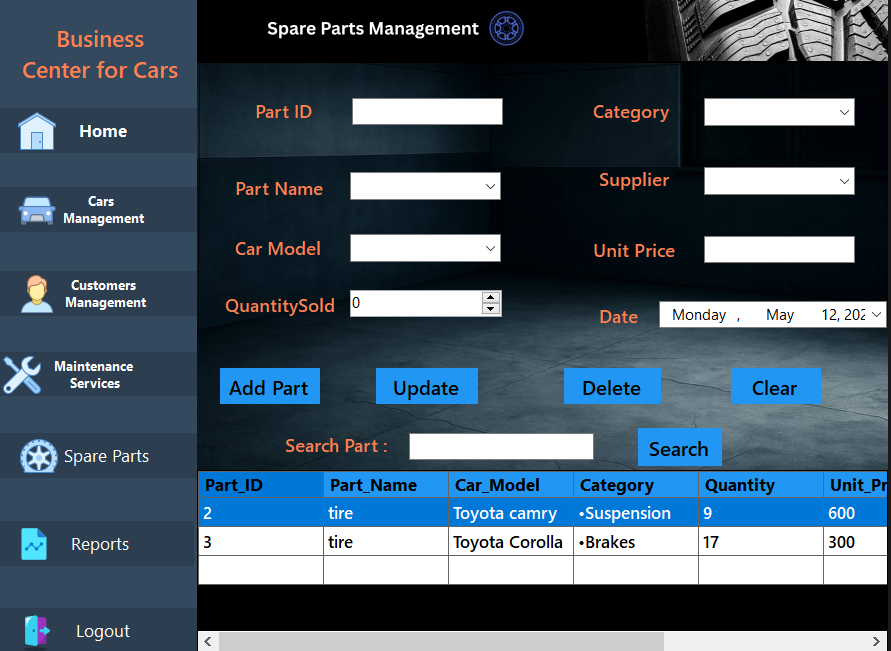
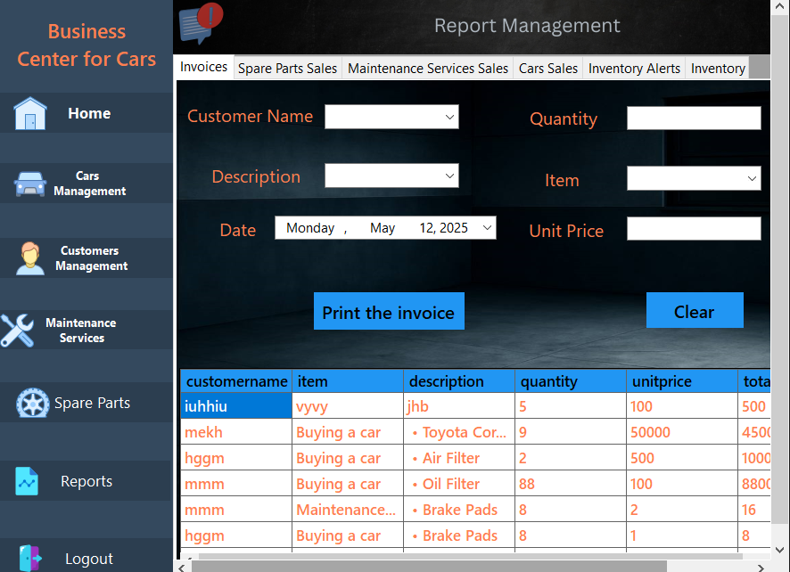

# Business Center for Cars  Management System

This is a desktop application built using C# WinForms to manage a Toyota car business center.

## Features

- Manage Cars (Available, Sold, etc.)
- Manage Customers and their purchases
- Handle Maintenance Requests
- Spare Parts Management
- Generate Reports

## Technologies Used

- C# (WinForms)
- SQL Server
- Git & GitHub

## Screenshots

### Login Page

### Staff Login Page

### Admin Login Page

### Dashboard Page

### Home page

### Maintenance_Services page

### Spare_Parts page

### Report page

